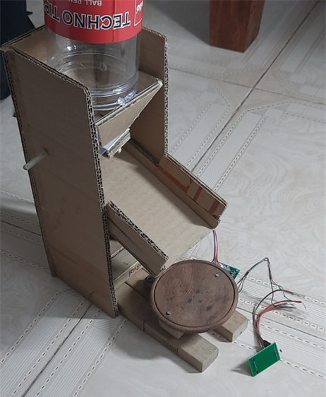

# The Pet Feeding System

There are certain complications when it comes to feeding our **pawed pals**. We may not be available to feed them, we might feed them more food than required, or in the worst case, forgetting to feed them. This system aims to solve this issue by automating the task of dispensing pet food at the scheduled times. 

- The system uses a **Raspberry Pi** controller, Model B as the central processing device. 
- A **stepper motor** is used for dispensing food, and a **10Kg Load cell** is used to measure the amount of food dispensed.
- All of these components are housed in a structure built using cardboard. 

- An Mobile application was developed using **Kotlin and Jetpack Compose**. This will be used to schedule the times of feed, and also displays analytics of the pets feeding habits using a graph. 

- An **Emqx MQTT** Broker and **HiveMQ** was used to facilitate the low latency transmission of data between the Pi and the android application. 

- **Cron tabs** runs the necessary scripts for controlling the sensors and actuators at scheduled hours. Currently system only feeds 50 gms of food per dispension.

